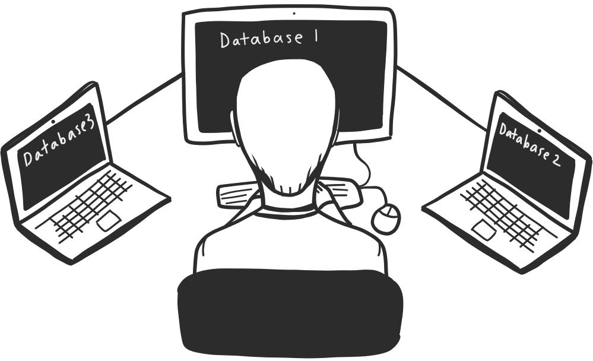

# <p align="center"></p>
# <p align="center"><strong>Security Analyst Dashboard.</strong> <br> A dashboard for cyber-physical system design and analysis.</p>


## About the paper
   * Title: Looking for a Black Cat in a Dark Room: Security Visualization for Cyber-Physical System Design and Analysis
   * Authors: Georgios Bakirtzis, Brandon J. Simon, Cody H. Fleming, Carl R. Elks
   
## Getting Started
   This project works in conjunction with [cybok-cli](https://github.com/bakirtzisg/cybok-cli) & [graphml_export](https://github.com/bakirtzisg/graphml_export).
   Security Analyst Dashboard acts as a user interface to use  [cybok-cli](https://github.com/bakirtzisg/cybok-cli) to find.
   This dashboard does not do any of the analysis, but rather provides a user interface to interactively visualize the data received by Cybok.

## Prerequisites

   The following are required to run the dashboard.

   * Git
   * Java JDK 8
   * Python 3.6.x
   * The prequisites found in  [cybok-cli](https://github.com/bakirtzisg/cybok-cli)


## Building and Running
The following script will automatically load the newest stable copy of  [cybok-cli](https://github.com/bakirtzisg/cybok-cli), compile, and run the dashboard.

   Windows:
   ```bash
  $ ./build_and_run.bat
   ```

 GNU/Linux
 ``` bash
 $ ./build_and_run.sh
 ```

## Features

### Topology Graph View
   
   An interactive graph view for the input system topology that represents the system you are working on. 
   Mousing over each node shows the attributes of the node as well as connections between other nodes. 
   Selecting a component will show all the exploit chains for that component.
   
   This panel also includes a simple graph editor, allowing the user to make modifications to the topology graph and repeating the analysis. 
   These modifications can include changes in the name, attributes, and the edges between each component.


### Specifications Graph

   This view shows a hierarchical representation of the inputted specifications graph, with the highest level requirements and the top and the lowest at the bottom. 
   The specifications are split into three different catagories; Mission level requirements, Functional level requirements, and Structural level requirements. 
   Mission level requirements represent the overall requirements that the system will need to accomplish. The functional requirements represent the specific functions the system will need to be able to do. 
   And the Structural level requirements represent the specific components used to accomplish all the requirements and should match the Topology graph.

### Attack Vector Graph View

   Shows a graph representation of matched Attack Vectors and their relationships as determined by the Cybok Tool. 
   By default, only CAPEC's and CWE's are shown while hiding CVE's. 
   A Filter bar is included to help narrow down the attack vectors that are relevant to the input topology.
   For more information on a specific attack, double-clicking the attack will open the website for that attack showing all the information on it.
   

### Attack Vector Tree View

   Shows a tree structured representation of matched Attack Vectors and their relationships as determined by the Cybok Tool. 
   This view shows the same data as found in the *Attack Vector Graph View* but with a tree structure, making parent/child relationships between attacks more easily navigated.
   The tree view also maintains much of the functionality as in the graph view.

### Bucket

   The Bucket is used to isolate selected attack vectors for later use and can be added from any of the above views. 
   The entries show the attack name, a brief description, and the components in the topology that it violates.
   Additionally, the bucket and be both exported/imported to/from a CSV file. This is useful for saving the results of your analysis to be sent to someone who will use the information.

## Usage

The dashboard will run checking to make sure you have the correct Python version and that Cybok is installed correctly. It will close if either had an issue.
On the first launch, you will be asked if you would like to update the cybok databases which is required for proper operation. This will take some time to complete.


#### GraphML Requirements

The System Topology and specifications files use GraphML files. Each have their own set of required attributes. You can find more information on GraphML Files [here](http://graphml.graphdrawing.org/).
Example topology and specification graphs can be found in the *data* folder. For converting SysML files to GraphML files, [graphml_export](https://github.com/bakirtzisg/graphml_export) can be used.

##### Topology GraphML Attribute Requirements

  | Attribute           | Description                                     |
  | ------------------- | ----------------------------------------------- |
  | `Entry Points`		| How external devices interacts with the system  |
  | `Software`		  	| What Software the node uses					  |
  | `Firmware`			| What Firmware the node uses					  |
  | `Operating System`	| What Operating System the node uses			  |
  | `Device	`		    | The device name that the node is 				  |

##### Specifications GraphML Attribute Requirements

  | Attribute     | Description                                           |
  | ------------- | ----------------------------------------------------- |
  | `Type`        | Type of requirement; Structure, Mission, or Function  |
  | `Description` | Description of the requirement                        |


###	Toolbar Options:

  | Attribute         | Description                                                                                   |
  | ----------------- | --------------------------------------------------------------------------------------------- |
  | `Load Topology`   | File loading dialog to select the topology and (optionally) the system specification file.	  |
  | `Attack Surfaces` | Toggles the visibility of attack surfaces on the topology graph.							  |
  | `Analysis` 		  | Performs the Attack Vector analysis on the topology graph using Cybok.						  |
  | `Show Deleted` 	  | Toggles the visibility of deleted attack vectors in the attack vector space and tree views.	  |
  | `Show Hidden` 	  | Toggles the visibility of hidden attack vectors in the attack vector space and tree views.	  |
  | `Show CVE` 		  | Toggles the visibility of CVE attack vectors in the attack vector space and tree views.		  |
  | `Add to Bucket`   | Adds all the selected attack vectors to the bucket.											  |
  | `Delete Attacks`  | Deletes all the selected attack vectors.													  |


### Key bindings

  | Command  | Description                                                                              |
  | -------- | ---------------------------------------------------------------------------------------- |
  | `CTRL+S` | save node positions of the selected graph to a file.                                  	|
  | `CTRL+L` | load node positions of the selected graph from file.                                  	|
  | `CTRL+E` | exports the selected graph as a .graphml file.                                        	|
  | `CTRL+F` | Toggles the built-in graph auto-layout for the selected graph.                           |
  | `CTRL+G` | (attack vector space)  grows the current selection (selects the nodes related to it). 	|
  | `CTRL+B` | (attack vector space) adds the selected nodes to the bucket.                      		|
  | `CTRL+I` | (attack vector space) opens a panel with additional information of the selected node. 	|
  | `CTRL+A` | (bucket) selects all visible nodes.                                                   	|
  | `DEL`    | deselects the current selection.                                                      	|
  | `DEL`    | (bucket) removes all checked entries from the bucket.                                 	|
